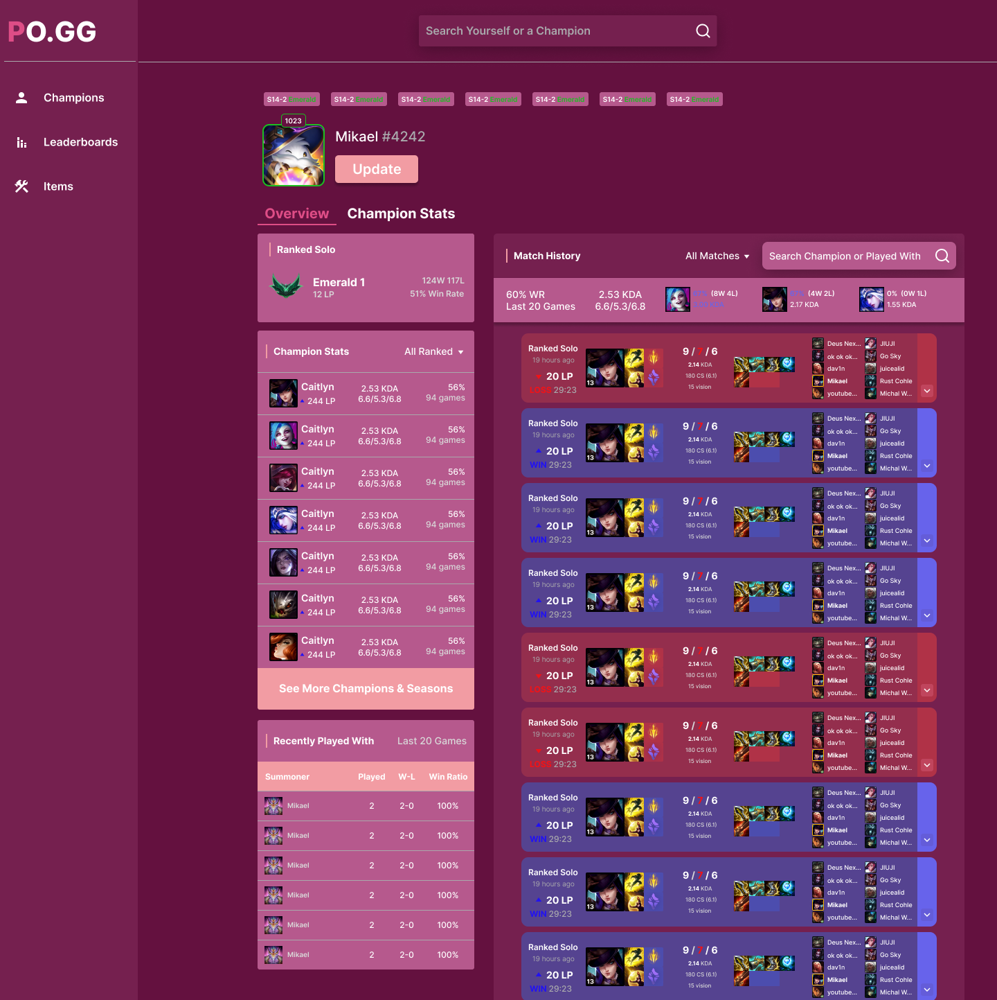

# PO\.GG 📊

PO\.GG is a web application to track your League of Legends statistics and compare them with your friends. It gathers data from the Riot Games API and displays it in a user-friendly way.

## Features

- **Profile**: View your profile with your most played champions, win rate, and more.

- **Matches**: Coming soon!
- **Leaderboard**: Coming soon!

## Technologies

- **Frontend**: Next.js, React, TypeScript, Tailwind CSS
- **Database**: MongoDB

## Visit us !

[Coming soon!](#)

## Contact

- **Email**: [mikael.vallenetpro@gmail.com](mailto:mikael.vallenetpro@gmail.com)

